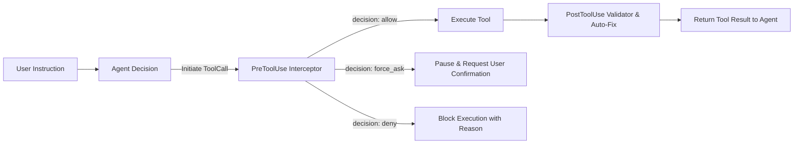

# Antigravity Hooks Examples & Production Guardrails

This directory provides production-grade examples and best practices for **Antigravity Hooks (Pre/Post-Tool Interceptors & Quality Guardrails)**.

---

## 1. What are Antigravity Hooks?

Antigravity Hooks allow you to inject custom validation, security guardrails, and auto-fix routines **before (PreToolUse)** and **after (PostToolUse)** an agent executes any tool:



* **`PreToolUse`**: Evaluates arguments before tool execution. Returns `allow`, `deny` (blocks execution), or `force_ask` (forces an interactive confirmation prompt to the user).
* **`PostToolUse`**: Runs static analysis, path leakage scans, or automated repairs (Auto-Fix) immediately after a tool creates or edits files.

---

## 2. Core Guardrail Suite (5 Production Guards)

| Guardrail Name | Trigger Point | Target Tools (`matcher`) | Action | Security Objective & Logic |
|---|---|---|---|---|
| **`system-survival-guard`** | `PreToolUse` | `run_command` | `force_ask` | **Destructive Command Intercept**: Catches `rm -rf`, `drop database`, `kubectl delete`, etc., requiring explicit manual confirmation. |
| **`secret-leak-guard`** | `PreToolUse` | `write_to_file`<br>`replace_file_content` | `deny` | **Hardcoded Secrets Blocker**: Intercepts plaintext OpenAI API keys (`sk-`), GitHub Tokens (`ghp_`), AWS Access Keys (`AKIA`), and RSA private keys. |
| **`anti-blind-mutation-guard`** | `PreToolUse` | `write_to_file`<br>`replace_file_content` | `deny` | **Anti-Blind Mutation Circuit Breaker**: Analyzes conversation history; when the user questions an approach, reports a defect, or requests discussion, stops the agent from guessing code mutations and requires upfront alignment. |
| **`noai-gate`** | `PreToolUse` | `write_to_file`<br>`replace_file_content` | `deny` | **Anti-AI & Syntax Gate (Shift-Left)**: Intercepts high-frequency AI buzzwords, mainland tech terms, and formulaic AI syntax patterns on documents before writing to disk (24ms latency, zero disk pollution). |
| **`post-tool-quality-guard`** | `PostToolUse` | `write_to_file`<br>`replace_file_content` | Advisory / Warning | **Static Quality & Syntax Guard**: <br>1. Scans for hardcoded local user paths (`/home/` or `/Users/`).<br>2. Emits advisory warning for unquoted node labels in Mermaid 11.x diagrams (avoids silent disk mutation drift).<br>3. Verifies Markdown code fence closure balance. |

---

## 3. Directory Layout

```
examples/hooks/
├── hooks.json                     # Global Hooks routing configuration (PreToolUse & PostToolUse rules)
├── anti_blind_mutation.py         # Anti-blind mutation circuit breaker (Python 3, Vibe Safe)
├── noai_gate.py                   # PreToolUse anti-AI & syntax gate (Python 3, stdlib only)
├── rules_gate.json                # Lightweight anti-AI buzzword and formulaic pattern dictionary
├── post_tool_quality_guard.py     # Static quality scanner and advisory guard (Python 3)
├── secret_leak_guard.py           # PreToolUse secret leak interceptor (Python 3, regex & entropy safe)
└── README.md                      # Architecture overview and deployment guide
```

---

## 4. Installation & Deployment

### Step 1: Create Directories & Copy Files
```bash
# Create local Hooks directories
mkdir -p ~/.gemini/hooks ~/.gemini/config

# Copy scripts and configuration
cp anti_blind_mutation.py post_tool_quality_guard.py secret_leak_guard.py ~/.gemini/hooks/
cp hooks.json ~/.gemini/config/hooks.json

# Grant execution permissions
chmod +x ~/.gemini/hooks/*.py
```

### Step 2: Verification
Upon restarting or initiating your next Antigravity session, any matching tool invocation will automatically trigger the respective hook guardrails defined in `hooks.json`.
