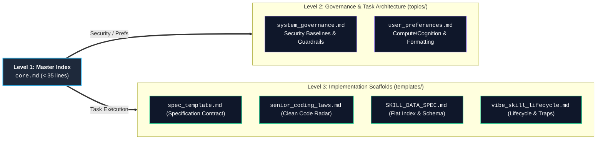

# Antigravity Production Templates & Memory Architecture

This directory provides production-grade templates, governance scaffolds, and architectural memory models for building deterministic, context-efficient agentic workflows in Google Antigravity.

---

## 1. 3-Tier Memory Hierarchy & Execution Flow

The memory system decouples lean index routing from deep governance and concrete execution contracts:



---

## 2. Component Directory & Responsibilities

### Global System Governance & Preferences (`topics/`)

| Topic | File | Core Responsibility & Boundary |
|---|---|---|
| **System Governance** | [`topics/system_governance.md`](topics/system_governance.md) | **Security & Runtime Guardrails**: OWASP/CIS standards, proven cryptography (AES-GCM, Ed25519, TLS 1.3), Zero-EOL runtimes (Python/Node/Go), credential file blacklist (`.ssh`, `.env`), 0-retry auth pause, and pre-delivery machine verification. |
| **User Preferences** | [`topics/user_preferences.md`](topics/user_preferences.md) | **Task Architecture & Formatting**: Compute vs cognition division of labor (Python computes, LLM formats), non-abstract specification purity, and compact output formatting (surgical diffs, ASCII trees). |

### Reference Templates (`templates/`)

| Template / Contract | File | Core Responsibility & Boundary |
|---|---|---|
| **Specification Contract** | [`spec_template.md`](templates/spec_template.md) | **No-Spec-No-Code Gate**: Freezes Goal, Non-Goals (what MUST NOT be done), Allowed Paths whitelist, dependencies, and deterministic verification command. |
| **Clean Code Radar** | [`senior_coding_laws.md`](templates/senior_coding_laws.md) | **5-Step Implementation Hygiene**: Boundary isolation, pure functional core, flattened flow (max `if` depth $\le 2$), useful error context, and subtractive delivery. |
| **Skill Data Standards** | [`SKILL_DATA_SPEC.md`](templates/SKILL_DATA_SPEC.md) | **Data & Indexing Rules**: Pattern A (flat list) universal default, thresholded in-memory inverted index ($N > 20$, $O(1)$ lookup), zero envelope tax. |
| **Skill Lifecycle Guide** | [`vibe_skill_lifecycle.md`](templates/vibe_skill_lifecycle.md) | **Evolution & Quality Guard**: 4-step build flow, 5 evolution traps rejection (no cognitive dumping, no ghost tools, no prompt-script contradictions), and 8-point pre-delivery cheatsheet. |

---

## 3. Directory Layout

```text
examples/memory/
├── README.md               # Architecture overview and hierarchy guide (Mermaid topology)
├── core.md                 # Lean index & routing table (< 35 lines)
├── topics/                 # Authoritative system governance & task architecture
│   ├── system_governance.md # Security baselines, runtime EOL, & agent execution brakes
│   └── user_preferences.md # Knowledge purity, compute/cognition division & formatting
└── templates/              # Concrete implementation scaffolds & contracts
    ├── spec_template.md    # 4+1 item specification contract boilerplate
    ├── senior_coding_laws.md # Clean code 5-step engineering radar
    ├── SKILL_DATA_SPEC.md  # Pattern A flat list vs Pattern B grouped taxonomy
    └── vibe_skill_lifecycle.md # 4-step lifecycle, 5 traps, 8-point checklist
```

---

## 4. Deployment to Local Environment

### Step 1: Create Memory Directories
```bash
mkdir -p ~/.gemini/memory/topics ~/.gemini/memory/templates
```

### Step 2: Deploy Scaffolds
```bash
# Copy core index sample
cp examples/memory/core.md ~/.gemini/memory/core.md

# Copy system governance topics
cp examples/memory/topics/*.md ~/.gemini/memory/topics/

# Copy production templates
cp examples/memory/templates/*.md ~/.gemini/memory/templates/
```

### Step 3: Link in System Instructions (`RULE[user_global]`)
```markdown
Persistent Memory Management:
  - Scope: Use `~/.gemini/memory/core.md` as index; workspace data MUST remain in `<workspace>/.memory/project.md`.
  - Load/Save: Read `core.md` at conversation start. Load governance topic and templates on-demand.
```
