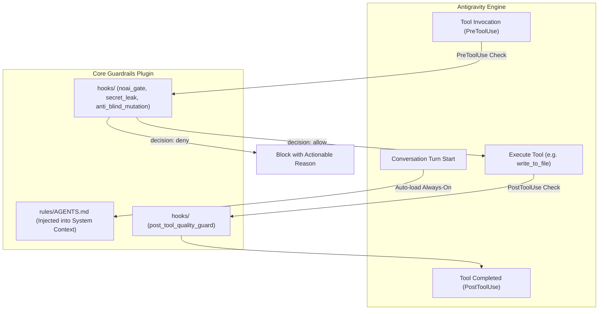

# Core Guardrails Plugin

Production-grade consolidated plugin for **Antigravity (AGY)** bundling always-on system rules, anti-AI writing gates, secret leak prevention, and AST quality guardrails.

---

## 1. Architecture Overview

This plugin follows AGY's native modular plugin standard (`~/.gemini/config/plugins/<name>/`):



---

## 2. Directory Layout

```text
plugins/core-guardrails/
├── plugin.json                 # Manifest declaring plugin name
├── hooks.json                  # Lifecycle hook bindings (Pre/PostToolUse)
├── rules/
│   └── AGENTS.md               # Source-level rules (Security, Portability, Anti-AI Voice)
└── hooks/                      # Guardrail scripts (Python stdlib)
    ├── noai_gate.py            # PreToolUse Anti-AI & Mainland term gate
    ├── rules_gate.json         # High-frequency buzzword dictionary
    ├── secret_leak_guard.py    # PreToolUse API key & private key leak blocker
    ├── anti_blind_mutation.py  # PreToolUse circuit breaker preventing unaligned code edits
    └── post_tool_quality_guard.py # PostToolUse hardcoded path scan & syntax checks
```

---

## 3. Deployment & Installation

### Option A: Deploy to Global Config (Recommended)
```bash
# 1. Create target plugin directory
mkdir -p ~/.gemini/config/plugins/core-guardrails

# 2. Copy all plugin files
cp -r examples/plugins/core-guardrails/* ~/.gemini/config/plugins/core-guardrails/

# 3. Grant execution permissions to hook scripts
chmod +x ~/.gemini/config/plugins/core-guardrails/hooks/*.py
```

### Option B: Deploy to Specific Workspace
```bash
# Deploy to <workspace>/.agents/plugins/core-guardrails
mkdir -p .agents/plugins/core-guardrails
cp -r examples/plugins/core-guardrails/* .agents/plugins/core-guardrails/
chmod +x .agents/plugins/core-guardrails/hooks/*.py
```

---

## 4. Verification

After deployment, start or restart an AGY session:
1. **Rule Verification**: Ask the agent for high-level advice; verify it follows direct, verb-led pacing and zero prohibited AI buzzwords.
2. **Hook Verification**: Test writing a dummy file containing `sk-test12345678901234567890` or `深度全面` to verify immediate interception by PreToolUse guards.
